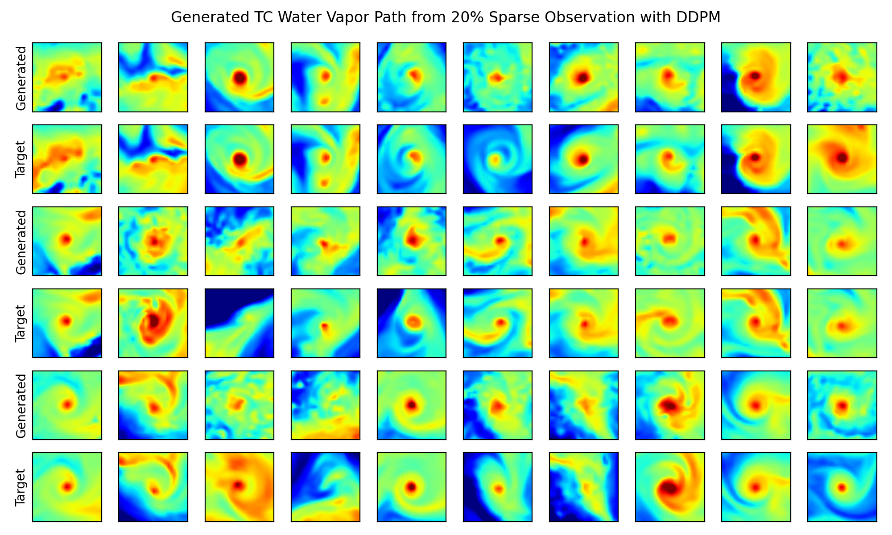
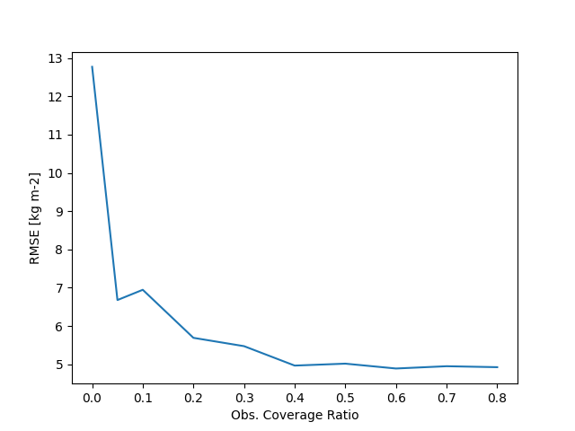

# Using DDPM to reconstruct Tropical Cyclones
Denoising Diffusion Probabilistic Model ([DDPM](https://arxiv.org/abs/2006.11239)) shows amazing ability for (conditional) image generation. In here, we use DDPM to generate tropical cyclones with sparse observations. 

The code are developed based one the blog [here](https://huggingface.co/blog/annotated-diffusion) and use the github repo [denoising-diffusion-pytorch
](https://github.com/lucidrains/denoising-diffusion-pytorch). 


## Generated TC with 20% observation coverage (variable: total column water vapor)

## Conditional generation erorr decreases as observation coverage increases



# Usage

Train model:
```
conda activate tcdiff
python train_tc_generative_wvp_rand.py 
```
Check the result with the inference [notebook](./inference_tc_ddpm_condition_rand_coverage.ipynb).


# envirment
Create the python envirment with conda
```
conda create -y -n tcdiff python=3.10 
conda activate tcdiff
```
Install pytorch following the guide [here](https://pytorch.org/get-started/locally/). The install other required packages.
```
conda install -y -c conda-forge matplotlib=3 
conda install -y -c conda-forge numpy numba scipy scikit-learn tqdm
conda install -y -c conda-forge pandas xarray netCDF4
pip install denoising_diffusion_pytorch
```
